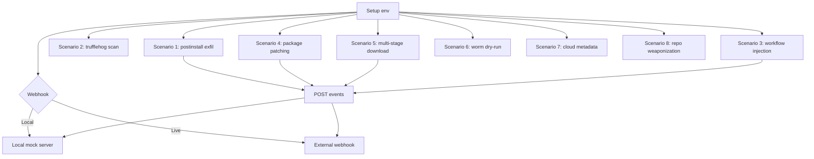

## NPM Threat Emulation

<div align="center">
  
</div>

[](https://github.com/MHaggis/NPM-Threat-Emulation)


### What is this?
- A lightweight set of scripts that simulate common NPM supply‑chain attack behaviors in a controlled way. Useful for testing detections, pipelines, and endpoint logging without risking real secrets.
- Uses fake tokens, a local POST‑aware mock server by default, and safe no‑op requests.

### Requirements
- macOS or Linux with bash/zsh
- Node.js and npm
- Python 3 (for the local mock server)
- git and curl
- Optional: Go (for Scenario 2 TruffleHog auto‑install), yarn/wget (for optional variations)

OS prerequisites (Ubuntu/Debian)

```bash
sudo apt-get update && sudo apt-get install -y nodejs npm python3 curl netcat
```

### Quick start
1) Clone and enter the repo

```bash
git clone https://github.com/MHaggis/NPM-Threat-Emulation.git
cd NPM-Threat-Emulation
```

2) Initialize the test environment

```bash
source ./setup_test_env.sh
```

- Exports fake tokens, sets `MOCK_WEBHOOK`, and starts a POST‑aware mock server on `:8080` if you are not using an external webhook.

3) Verify the webhook endpoint responds

```bash
curl -s -o /dev/null -w "%{http_code}\n" -X POST "$MOCK_WEBHOOK" -d test=1
# expected: 200
```

4) Run a single scenario (1–9)

```bash
./scenarios/scenario_1.sh
```

5) Or run all scenarios (60s pause between each, 1-9)

```bash
./run_npm_emulation_tests.sh
```

6) Stop the mock server only (optional)

```bash
./stop_server.sh
```

7) Reset between test runs (cleans temp, npm cache, and stops local server)

```bash
./reset_between_tests.sh
```

8) Cleanup everything (remove artifacts, caches, and stop server)

```bash
./cleanup_test_env.sh
```

### Webhooks: local vs live
- Default: Local mock server at `http://localhost:8080/webhook-receiver` started by `setup_test_env.sh`.
- Use a live webhook URL (e.g., `https://webhook.site/<uuid>`):
  - Interactive:
    ```bash
    ./choose_webhook.sh
    source ./setup_test_env.sh
    ```
  - Direct and persisted:
    ```bash
    source ./use_webhook_url.sh https://webhook.site/<uuid>
    source ./setup_test_env.sh
    ```
- Payloads received by the local server are saved under `tmp/payload_*.bin` for verification.

### Scenarios at a glance
- 1 Malicious Postinstall: triggers `postinstall` that POSTs to `MOCK_WEBHOOK`. Also tries curl/wget/yarn variations.
- 2 TruffleHog Scan: downloads real TruffleHog binary from GitHub releases (mimics Shai-Hulud); scans fake secrets and posts structured payload with base64-encoded results.
- 3 Workflow Injection: drops `.github/workflows/shai-hulud-workflow.yml` during an npm run; workflow posts to `MOCK_WEBHOOK`.
- 4 Package Patching: appends a small payload into `node_modules/left-pad/index.js` during install and attempts a POST to the local server.
- 5 Multi‑Stage Download: downloads stage1 and stage2 to `/tmp`, then deletes them. Uses external `MOCK_WEBHOOK` when set; otherwise local mock server endpoints.
- 6 Worm Propagation: simulates `npm publish --dry-run` across 5 packages using `NPM_TOKEN` from the fake token.
- 7 Cloud Metadata Probe: probes AWS/GCP/Azure metadata endpoints with short timeouts.
- 8 Repo Weaponization: creates a repo and commits a `data.json` that includes fake tokens and env details.
- 9 Bundle Worm Chain: repacks a tarball with `bundle.js` and spawns `/tmp/processor.sh` plus `/tmp/migrate-repos.sh` for defenders to track.

#### Visual overview



### Details and tips
- `setup_test_env.sh` exports `FAKE_*` tokens and will start `mock_server.py` unless you configured a live `MOCK_WEBHOOK`.
- To confirm the local server is up:
  ```bash
  curl -X POST "$MOCK_WEBHOOK" -d ping=1
  # expected HTTP 200
  ```
- If Python 3 is not installed, the local server will not start. Provide a live `MOCK_WEBHOOK` instead (see above).
- Some scenarios use optional tools (e.g., TruffleHog, yarn, wget). They are skipped gracefully when not present.

### Troubleshooting
- Port 8080 busy: set a live `MOCK_WEBHOOK` using the scripts above and re‑source `setup_test_env.sh`.
- `.env` not written: the scripts still export `MOCK_WEBHOOK` in your shell. If needed, export it manually, then `source ./setup_test_env.sh`.
- npm or git prompts: the scripts are designed to run non‑interactively and ignore failures where safe.

### Safety
- All secrets used are fake and for testing only.
- If you set a live `MOCK_WEBHOOK`, requests will be sent to that URL. Use a URL you control.