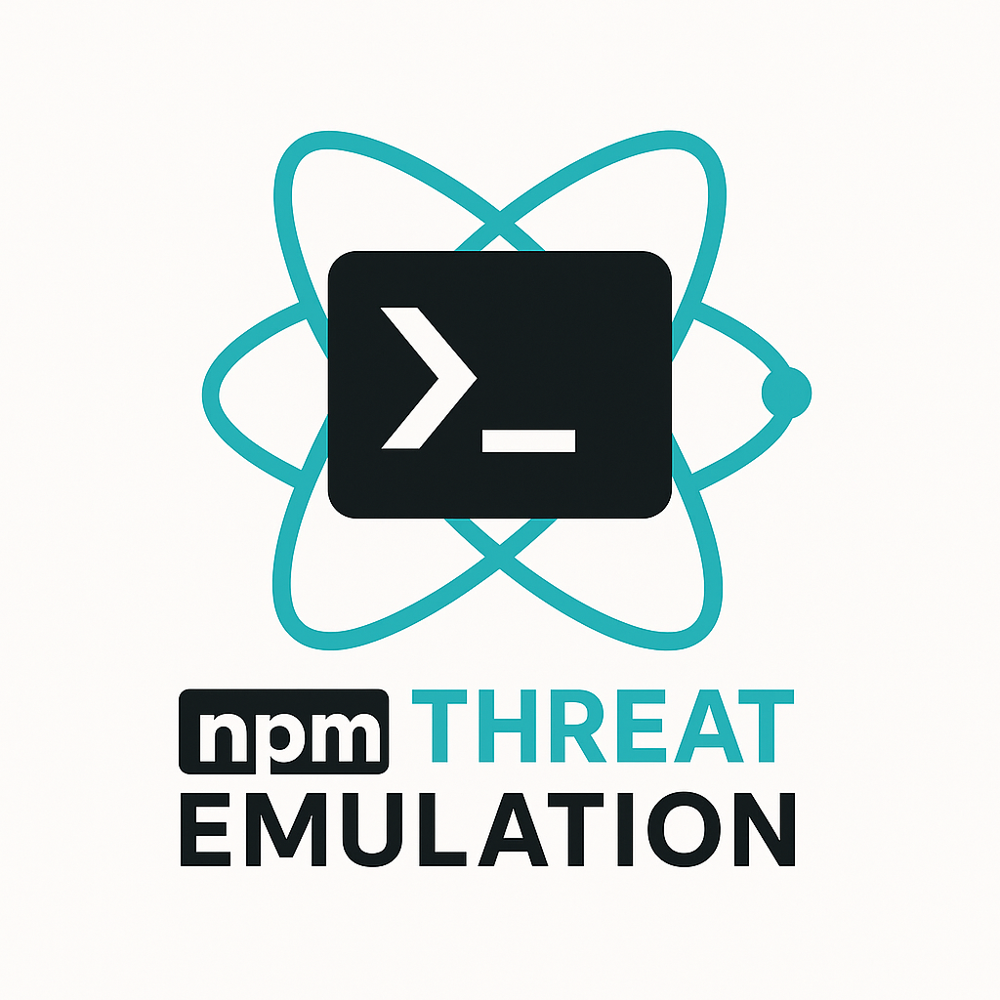

## NPM Threat Emulation - Windows Edition

<div align="center">
  
</div>

[](https://github.com/MHaggis/NPM-Threat-Emulation)

### What is this?
A PowerShell-native version of the NPM Threat Emulation toolkit for Windows environments. Simulates common NPM supply-chain attack behaviors using PowerShell scripts and a built-in HTTP server.

### Requirements
- Windows 10/11 or Windows Server 2016+
- PowerShell 5.1+ (PowerShell 7+ recommended)
- Node.js and npm
- Git for Windows
- Internet connection for external webhooks (optional)

### Quick Start

**🚀 Super Easy Mode (Auto-installs everything!):**
```powershell
# One command to rule them all!
irm https://raw.githubusercontent.com/MHaggis/NPM-Threat-Emulation/main/windows/INSTALL.ps1 | iex
```

**🛠️ Manual Mode:**
1) **Clone and navigate to the Windows folder**
```powershell
git clone https://github.com/MHaggis/NPM-Threat-Emulation.git
cd NPM-Threat-Emulation\windows
```

2) **Run setup (auto-installs Node.js, npm, git if missing!)**
```powershell
.\Setup-TestEnvironment.ps1
```
This will:
- ✅ Auto-detect and install missing requirements (Node.js, npm, git)
- 🎯 Export fake tokens to environment variables  
- 🌐 Start a local HTTP server on port 8080 (if no external webhook configured)
- 📁 Create necessary temp directories

3) **Verify the webhook endpoint**
```powershell
Invoke-RestMethod -Uri $env:MOCK_WEBHOOK -Method POST -Body @{test=1}
# Expected: HTTP 200 response
```

4) **Run a single scenario**
```powershell
.\scenarios\Scenario-1.ps1
```

5) **Run all scenarios with 60s pause between each**
```powershell
.\Run-AllScenarios.ps1
```

6) **Clean up when done**
```powershell
.\Cleanup-TestEnvironment.ps1
```

### Webhook Options

**Option 1: Use local HTTP server (default)**
- Automatically starts when running `Setup-TestEnvironment.ps1`
- Listens on `http://localhost:8080/webhook-receiver`
- Payloads saved to `tmp\payload_*.json` files

**Option 2: Use external webhook (webhook.site)**
```powershell
.\Choose-Webhook.ps1
```
Follow the prompts to enter your webhook.site URL or other external endpoint.

**Option 3: Direct webhook configuration**
```powershell
$env:MOCK_WEBHOOK = "https://webhook.site/your-uuid-here"
.\Setup-TestEnvironment.ps1
```

### Scenarios Overview

| Scenario | Description | Key Behaviors |
|----------|-------------|---------------|
| 1 | Malicious Postinstall | Triggers postinstall script with HTTP POST |
| 2 | TruffleHog Simulation | Downloads/simulates secret scanning tool |
| 3 | Workflow Injection | Creates malicious GitHub workflow file |
| 4 | Package Patching | Modifies node_modules files during install |
| 5 | Multi-Stage Download | Downloads and executes staged payloads |
| 6 | Worm Propagation | Simulates npm publish across multiple packages |
| 7 | Cloud Metadata Probe | Probes AWS/Azure/GCP metadata endpoints |
| 8 | Repo Weaponization | Creates git repo with embedded secrets |
| 9 | Bundle Worm Chain | Creates weaponized tarball with executables |

### Script Overview

| Script | Purpose |
|--------|---------|
| `Setup-TestEnvironment.ps1` | Initialize environment and start HTTP server |
| `MockServer.ps1` | PowerShell HTTP server for local testing |
| `Run-AllScenarios.ps1` | Execute all scenarios sequentially |
| `Choose-Webhook.ps1` | Interactive webhook configuration |
| `Cleanup-TestEnvironment.ps1` | Clean up artifacts and stop server |
| `Reset-BetweenTests.ps1` | Reset environment between test runs |
| `Stop-Server.ps1` | Stop only the HTTP server |

### PowerShell Features Used
- **HttpListener**: Built-in HTTP server functionality
- **Invoke-RestMethod**: HTTP client for webhook calls
- **Start-Job**: Background job management
- **Compress-Archive**: Tarball creation and extraction
- **Test-NetConnection**: Network connectivity testing

### Safety Notes
- All tokens and secrets are fake/simulated
- External webhook calls only go to URLs you configure
- No real malicious code execution
- All artifacts contained in temp directories

### Troubleshooting

**Port 8080 in use:**
```powershell
# Use external webhook instead
$env:MOCK_WEBHOOK = "https://webhook.site/your-uuid"
.\Setup-TestEnvironment.ps1
```

**PowerShell execution policy:**
```powershell
Set-ExecutionPolicy -ExecutionPolicy RemoteSigned -Scope CurrentUser
```

**npm/git not found:**
```powershell
# Install via chocolatey
choco install nodejs git
```

**HTTP server won't start:**
- Check if port 8080 is available: `netstat -an | findstr :8080`
- Run PowerShell as Administrator if needed
- Use external webhook as alternative

### Windows-Specific Adaptations
- Uses PowerShell jobs instead of background processes
- Leverages .NET HttpListener for HTTP server
- Windows-compatible file paths and temp directories
- PowerShell-native HTTP client methods
- Windows service/process management commands

### Monitoring What to Look For

#### Network Traffic
- HTTP POST to webhook URLs
- Metadata endpoint probes (169.254.169.254)
- GitHub API calls
- npm registry requests

#### File System Activity
- `.github/workflows/` creation
- `node_modules/` modifications
- Temp file creation (`$env:TEMP\*.js`, `*.ps1`)
- Git repository creation

#### Process Activity
- `npm install/publish` commands
- PowerShell background jobs
- Node.js execution
- Git commands

### Payload Analysis

Local server saves all payloads to `tmp\payload_*.json`:

```powershell
# View captured payloads
Get-ChildItem tmp\payload_*.json | ForEach-Object {
    Write-Host $_.Name -ForegroundColor Cyan
    Get-Content $_ | ConvertFrom-Json | ConvertTo-Json -Depth 10
}
```

### Customization

Change delay between scenarios:

```powershell
.\Run-AllScenarios.ps1 -DelaySeconds 10
```

Run specific scenario range:

```powershell
.\Run-AllScenarios.ps1 -StartFrom 3 -EndAt 6
```

Custom webhook:

```powershell
$env:MOCK_WEBHOOK = "https://your-custom-endpoint.com/webhook"
.\Setup-TestEnvironment.ps1
```